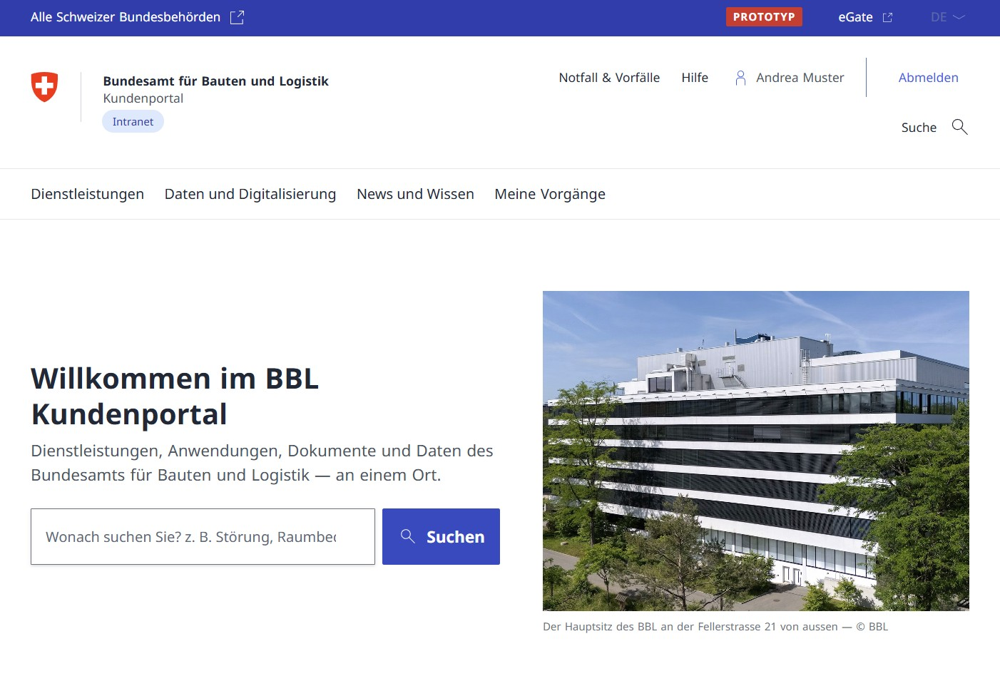
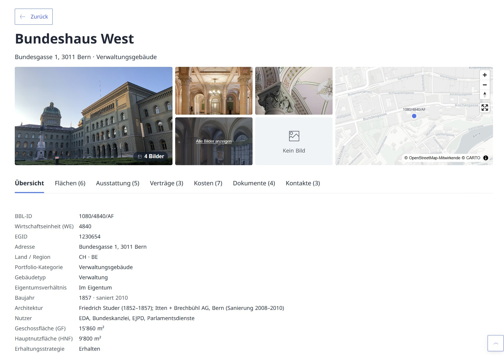

# BBL Kundenportal (Service Portal)

<p align="center">
  
</p>

<p align="center">
  <a href="https://opensource.org/licenses/MIT"></a>
  
  
  
  
  
  <a href="https://github.com/swiss/designsystem"></a>
  
  
  <a href="https://bbl-dres.github.io/service-portal/"></a>
</p>

> [!CAUTION]
> **This is an unofficial mockup for demonstration purposes only.**
> All data is fictional. Not all features are fully functional. This project serves as a visual and conceptual prototype — it is not intended for production use.

Prototype of the customer portal (**Kundenportal**) for the [Federal Office for Buildings and Logistics (Bundesamt für Bauten und Logistik, BBL)](https://www.bbl.admin.ch). It brings the fragmented BBL intranet and five separate domain tools together behind one process-oriented front door: administrative units order services, track their cases (Vorgänge) through a live status pipeline, browse the real-estate portfolio and building documentation, and reach every specialist application and dataset from one catalogue — all in the Swiss Confederation corporate design (**CD Bund**).

## Preview

**Live Demo:** https://bbl-dres.github.io/service-portal/

<p align="center">
  
</p>

<p align="center">
  
  
</p>

## Features

### Core flows

- **Search-first home** — one question (*«Was benötigen Sie?»*) over services, applications, datasets, documents and news, with faceted results in list or gallery view, sort and pagination.
- **Service catalogue (Dienstleistungen)** — every offering as a card with audience tag (intern / extern) and type (*Vorgang* vs. *Information*); detail pages carry prerequisites, the responsible contact and the governing directives (Weisungen).
- **Case wizard → live pipeline** — *Raumbedarf melden* runs a 3-step application (workplace-standards NAW classification, m²/FTE area estimate, validation summary). Submitting creates a **Vorgang** under *Meine Vorgänge* with a status pipeline you can advance step by step; linked building and project are cross-referenced.
- **Fault reporting (Störungsmeldung)** — single-form incident capture with urgency, location and a security-incident variant.
- **Liegenschaften Inventar** — the SAP RE-FX golden record as a map-first explorer: a spatial tree (Land › Region › Stadt › Wirtschaftseinheit › object), a clustered MapLibre map, gallery and list views, and a per-object detail page with an image mosaic, full-screen gallery, and paginated tables for areas, fixtures, contracts, costs, contacts and documents.
- **Datenportal** — Superset-style analysis dashboards (energy & climate, real estate, procurement, personnel, logistics) with a global year-range filter, tabbed views, a KPI row and a grid of SVG charts (bar, line, donut, stacked) rendered without a charting library.
- **Datenbezug und API Verzeichnis** — a DCAT-flavoured dataset catalogue plus a mock Swagger micro-app with data-backed *«Ausprobieren»* requests.
- **Bauwerksdokumentation & Mediathek** — the building document archive, filterable by building, type, year and classification, with an in-app document viewer; plus the media library.
- **Digitalisierung, Weisungen und News** — the strategy pages, the directives catalogue, process documentation and the newsroom.

### Federal Corporate Design (CD Bund) alignment

- Aligned to [`swiss/designsystem`](https://github.com/swiss/designsystem) **v1.0.5** — typography, colour ramps, layout, spacing, and the component BEM layer (`card`, `catbar`, `pagination`, `tabs`, `steps`, `filter-panel`, `notification`, `modal`).
- **Swappable brand skins.** Two ramps are re-tinted at runtime by a body class: default federal red `#d8232a` and `.body--intranet` blue. Purple `#8655F6` is reserved solely for the focus ring, exactly as CD prescribes.
- Bundled Noto Sans, the coat-of-arms / wordmark logos and the official icon set.
- **WCAG 2.1 AA / BehiG.** Skip link, an unbroken heading outline on every surface, keyboard-reachable scroll regions, focus traps on all overlays, `prefers-reduced-motion`, ARIA disclosure for dropdowns, live-region announcements for result counts, a 44/48/52 px touch-target ramp, and 320 px reflow (WCAG 1.4.10).
- See [`docs/design-review.md`](docs/design-review.md) for the full CD gap analysis and the staged alignment tracker.

### Technical

- **Hash-routed SPA** — no framework, no build step, no `package.json`. Plain ES modules and template-string components.
- **Zero runtime dependencies.** MapLibre GL JS is lazy-loaded from a CDN only when a map is actually opened; everything else is local.
- **URL state persistence** — view mode, filters, sort and pagination live in the URL hash, so every list view is shareable.
- **A shared mock core** — one accessor (`js/core.js`) over 24 JSON / GeoJSON files is the single source of truth for every page; `js/process-engine.js` is a mock "Camunda" (process definitions, instances, status transitions).
- **Charts and maps built in-house** — SVG charts with token-driven palettes and PNG export; MapLibre maps over swisstopo (CH) and CARTO basemaps, with clustering and cooperative gestures.

## Running locally

No build tools, no dependencies — just static files. But ES modules and `fetch()` need HTTP, so serve the folder rather than opening `index.html` from disk:

```bash
# Python
python -m http.server 8848

# Node
npx http-server -p 8848
```

Then open http://127.0.0.1:8848/. Tested in Edge/Chrome; current Firefox/Safari.

> [!NOTE]
> Building, media and news photography are stock images from [Unsplash](https://unsplash.com) (a `photo` field holds an Unsplash id, rendered via `C.photo()`) — they are **not** photographs of the real federal buildings. They load from `images.unsplash.com`, so the demo wants internet access for imagery; offline, every image degrades to a flat colour block and nothing else changes.

## Modules

### Main areas

| Route | Description |
|---|---|
| `#/` | Search-first home: open cases, frequent services, topics, news |
| `#/services` | Service catalogue — filter by audience, type and topic |
| `#/services/:serviceId` | Service detail: description, prerequisites, contact, directives |
| `#/search?q=` | Global faceted search (list / gallery, sort, pagination) |
| `#/my-cases` | My cases (Vorgänge) with status pipeline |
| `#/my-cases/:id` | Case detail: tabs for data, attachments and history |

### Data and digitalisation

| Route | Description |
|---|---|
| `#/data` | Overview of data, applications and digitalisation |
| `#/data/katalog` | Dataset catalogue (DCAT-flavoured) |
| `#/data/katalog/:id` | Dataset detail: distributions, roles, classification |
| `#/data/digitalisierung` | Strategy, vision and principles |
| `#/applications` | Application catalogue (specialist software launcher) |
| `#/knowledge` | News, directives (Weisungen) and process documentation |

### Micro-applications

| Route | Description |
|---|---|
| `#/app/portfolio` | Liegenschaften Inventar — map / gallery / list + object detail |
| `#/app/dataportal` | Analysis dashboards (topic landing + per-topic boards) |
| `#/app/document-archive` | Bauwerksdokumentation — filterable document archive |
| `#/app/mediathek` | Media library |
| `#/app/projects` | Construction projects (Bauprojekte) |
| `#/app/workspace` | Workspace / office planning |
| `#/app/api-docs` | Mock Swagger API directory with live «Ausprobieren» |
| `#/app/space-request` | 3-step space-needs wizard (Raumbedarf melden) |
| `#/app/fault-report` | Fault and incident reporting (Störungsmeldung) |
| `#/app/transaction` | Order / transaction detail |

## Structure

```
index.html                   # shell entry (links css/ + js/app.js)
css/  tokens.css             # CD Bund design tokens (colour, type, spacing, motion, z-index)
      app.css                # federal shell + the component layer, hand-written vanilla CSS
assets/  fonts/ icons/ images/ swiss-logo-flag.svg swiss-logo-name.svg
data/                        # the shared mock core — 24 JSON / GeoJSON files
js/   app.js                 # bootstrap: load core + engine, render shell, start router
      shell.js               # three-row federal header, mega-drawer navigation, footer
      router.js              # hash router, NAV definition, page/app module maps
      core.js                # shared data core accessor (single source of truth)
      process-engine.js      # mock "Camunda": process definitions, instances, status
      components.js          # the shared UI library (C.*) — cards, tables, catbar, …
      charts.js              # dependency-free SVG charts + PNG export
      buildings-map.js       # MapLibre integration (lazy CDN load, clustering)
      doc-viewer.js          # full-screen document preview
      session.js storage.js export.js fetch-json.js
  pages/  home · services · applications · data · katalog · knowledge · grundlagen ·
          digitalisierung · ikt-vorhaben · my-cases · search · application
  apps/   portfolio · estate · dataportal · document-archive · mediathek · projects ·
          workspace · api-docs · space-request · fault-report · transaction
docs/                        # vision, sitemap, requirements, data model, reviews
scripts/                     # headless CDP test suites (see below)
bbl-intranet/                # source material analysed for the redesign (gitignored)
```

Each page and app is an ES module exporting `default async function render(ctx)`. The router injects `ctx` — `mount, params, query, core, engine, session, C, navigate, setTitle, setCrumbs, stale`.

## Testing

Ten headless suites drive a real Edge instance over the Chrome DevTools Protocol (no Puppeteer, no dependencies) and assert behaviour rather than screenshots — clicks, keyboard paths, focus order, login-gated flows and race conditions on fast navigation:

```bash
python -m http.server 8848 &          # the suites expect a server on 8848
for t in apidocs catalogue content dashboard estate forms login portfolio race tabs; do
  node scripts/test-$t.mjs
done
```

## Documentation

See [`docs/README.md`](docs/README.md) for the index — the platform [vision](docs/platform-vision.md), [sitemap / IA](docs/sitemap.md), [requirements](docs/requirements.md), [data model](docs/data-model.md), the [portfolio redesign](docs/portfolio-redesign.md), the senior engineering [code review](docs/code-review.md) and the CD Bund [design review](docs/design-review.md).

## Known limitations

Deliberately out of scope for a prototype: no real authentication or SSO (eIAM / AGOV), no records management or GEVER retention, no RBAC or classification enforcement, no real process engine, no write-back to source systems, and German only (FR/IT are not translated; the language switcher is disabled rather than faked). All data is synthetic.

## License

[MIT](LICENSE) © Digital Real Estate and Support
