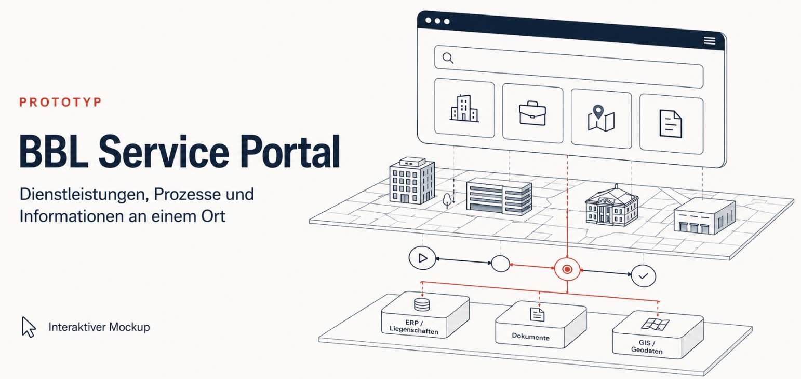

# BBL Kundenportal (Service Portal)

<p align="center">
  
</p>

<p>
  <a href="https://opensource.org/licenses/MIT"></a>
  
  <a href="https://github.com/swiss/designsystem"></a>
  <a href="https://bbl-dres.github.io/service-portal/"></a>
</p>

> [!CAUTION]
> **This is an unofficial prototype for demonstration purposes only.**
> The repository is intended to contain only fictional or publicly releasable data, and not every function is fully implemented. The current [technical review](docs/code-review.md) lists data and media whose publication or redistribution status still requires owner confirmation. The prototype is not intended for production use.

The BBL Kundenportal is a process-oriented prototype for the [Federal Office for Buildings and Logistics (BBL)](https://www.bbl.admin.ch). It brings services, cases, specialist applications, property information, documents, and data access together in one interface based on the Swiss Confederation design system.

## Demo

**Live demo:** https://bbl-dres.github.io/service-portal/

## Scope

- Service catalogue, guided forms, and case tracking
- Property inventory, building documentation, media, and project views
- Workspace planning, room booking, and the BBL intranet shop
- Application and data catalogues, dashboards, process documentation, and knowledge content

## Technical overview

- Static single-page application with hash routing
- Vanilla JavaScript ES modules, HTML, and layered CSS: no build step, package manager, runtime framework, or installed dependencies
- Static JSON and GeoJSON repository fixtures shared across the portal and its micro-apps
- UI patterns and tokens aligned with the official [`swiss/designsystem`](https://github.com/swiss/designsystem)
- Pinned MapLibre GL JS, Swagger UI, and bpmn-js assets are loaded only when needed over HTTPS, with SHA-384 Subresource Integrity, anonymous CORS, and no-referrer policy
- Three.js is vendored locally; route-specific CSS is also loaded lazily and awaited before a micro-app renders
- Dependency-free Node/CDP browser checks documented in [`scripts/README.md`](scripts/README.md)

### JavaScript structure

```text
js/
├── app.js                 # shell bootstrap
├── core/                  # data loading, storage, session, shared state and CDN loader
├── routing/               # route table, lifecycle-aware router and lazy CSS loader
├── ui/                    # reusable components, shell and presentation helpers
├── map/                   # map slots, building maps and cluster navigation
├── search/                # indexing, suggestions and local diagnostic log
├── floorplan-editor/      # editor model, commands, rendering and controllers
├── apps/                  # specialist micro-app entry points
├── pages/                 # portal page renderers
├── security/              # URL/resource policies and untrusted-text boundaries
└── *.js                   # stable shared APIs and compatibility facades
```

Root modules such as `components.js`, `links.js`, and `format.js` keep stable
imports for existing consumers; `components.js` is the compatibility facade
over the grouped `ui/components/` implementation.

Map tiles, geocoding, address search, and some stylesheet-owned fonts remain
dynamic third-party resources and cannot be covered by the top-level SRI
hashes. Map views and those searches therefore require network access and can
be affected by provider availability or policy changes. The app reports these
failures, but a production deployment should review the residual risks and
self-host where appropriate; see the [technical review](docs/code-review.md).

## Run locally

Serve the repository over HTTP because ES modules and `fetch()` do not work reliably from `file://`:

```bash
node scripts/serve.mjs
```

Then open http://127.0.0.1:8848/.

The development server binds to loopback by default. To test from another
device, opt in to a LAN bind and allow every hostname or IP that clients will
send in the HTTP `Host` header (comma-separated):

```powershell
$env:SERVICE_PORTAL_HOST = '0.0.0.0'
$env:SERVICE_PORTAL_ALLOWED_HOSTS = '192.168.1.25,devbox.local'
node scripts/serve.mjs
```

This is a hardened development server, not a production TLS endpoint. Its
request and compression behavior is documented in
[`scripts/README.md`](scripts/README.md#development-server).

## Documentation

Architecture, requirements, data models, design reviews, and implementation notes are collected in [`docs/`](docs/README.md).

## License

Licensed under the [MIT License](LICENSE).
