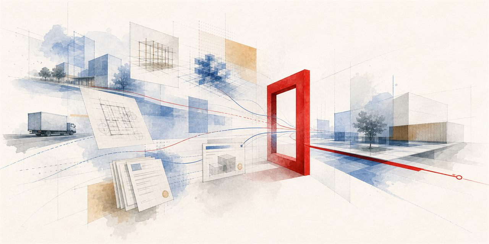
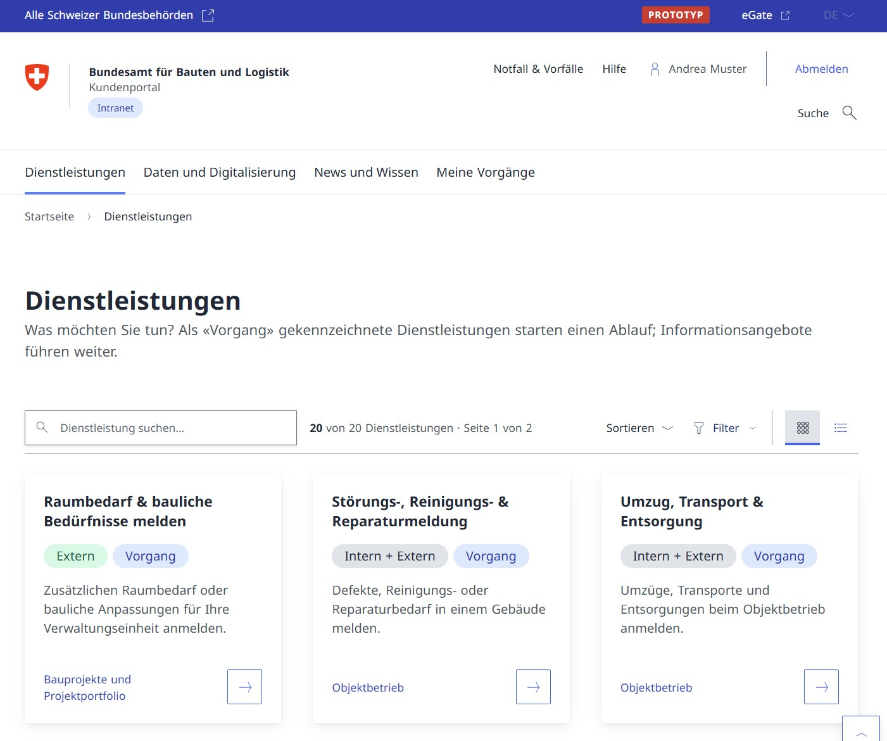

# BBL Kundenportal (Service Portal)

<p align="center">
  
</p>

[](https://bbl-dres.github.io/service-portal/)
[](LICENSE)

> [!CAUTION]
> This is an unofficial demonstration prototype. It contains only fictional or publicly releasable material, not every function is implemented, and it is not intended for production use.

A process-oriented BBL service-portal prototype that brings services, cases, specialist applications, property information, documents, and data access into one interface based on the Swiss Confederation design system.

## Demo

**Live demo:** https://bbl-dres.github.io/service-portal/

<p align="center">
  
  
</p>

## Features

- Browse a service catalogue, complete guided forms, and follow cases.
- Explore property inventory, building documentation, media, and project views.
- Plan workspaces, edit floor plans locally, check DWG files, and book rooms.
- Access the intranet shop, application and data catalogues, dashboards, and process documentation.
- Search portal content and navigate specialist micro-apps through one consistent shell.
- Keep selected DWG files and generated Planprüfung reports in the browser rather than uploading them to a service.

## Run locally

The portal is a static application that loads repository fixtures, so serve it over HTTP:

```bash
python -m http.server 8000
```

Then open <http://localhost:8000/>.

## Documentation

- [Documentation index](docs/README.md) — requirements, architecture, data models, design, and implementation notes.
- [Production architecture review](docs/production-architecture.md) — prototype risks and a possible production path.
- [Verification scripts](scripts/README.md) — local checks and maintenance tooling.

## License

Original portal code is licensed under the [MIT License](LICENSE). Bundled and adapted third-party material remains under its own terms; review [Third-party notices](THIRD_PARTY_NOTICES.md) before copying or distributing the repository.

The bundled `libredwg-web` runtime is GPL-3.0 software and is not relicensed under MIT. Anyone conveying it must preserve its license and notices and meet the GPL-3.0 complete-corresponding-source obligations documented in its [provenance record](js/vendor/libredwg/README.md).
